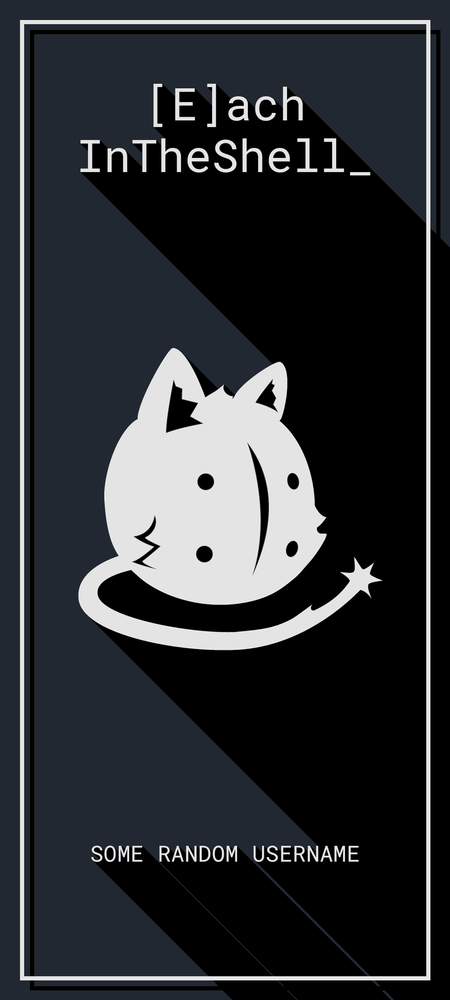

# wallpaper eits

#### Warning

You need to set the path to Robot Mono font in the source code.
(Settings are in the main function)

#### Usage

A script that given a name and a size it will generate a wallpaper:

```bash
./eits --height=2400 -w=1080 -u=doombringer_azurai
```

or

```bash
./launch.sh
```

#### Output:


